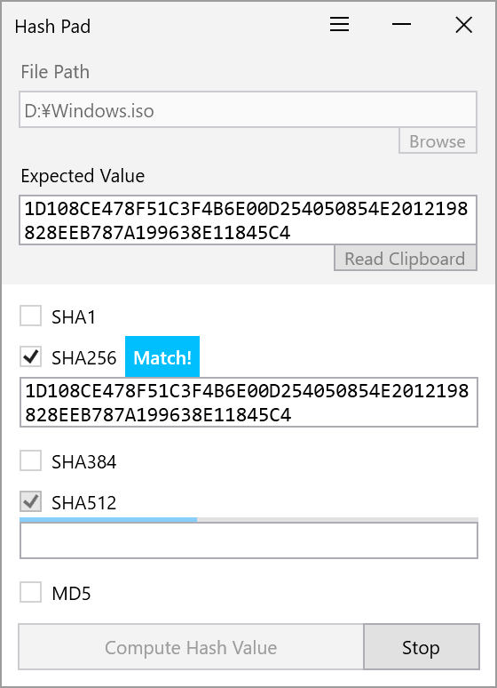
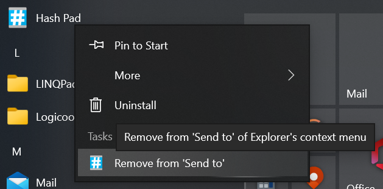

# Hash Pad

Hash Pad is a simple tool to compute and compare hash value including from Explorer's context menu. It is specially designed to complete hash check in the minimum steps.

Currently, SHA-1, SHA-2 (256bit, 384bit, 512bit), SHA-3 (256bit, 384bit, 512bit, only on Windows 11 24H2) and MD5 are supported.

 
(DPI: 175%)

Additonal languages:

 + German (de-DE) by @DocBrown101
 + Japanese (ja-JP) by @emoacht
 + Simplified Chinese (zh-Hans) by @nkh0472
 + Traditional Chinese (zh-Hant) by @nkh0472

## Requirements

 * Windows 10, 11
 * .NET 8.0

## Download

## Usage

 - To specify a file to be checked,
   + Open Explorer's context menu on the file, go to `Send to` and then select this app. To add the shortcut of this app in `Send to`, tap the hamburger button of this app and check `Add to 'Send to' of Explorer's context menu`. 
   or
   + Drag and drop the file to this app's window. 
   or
   + Tap `Browse` button and select the file from file dialog.
 - To fill `Expected Value` which is compared with computed hash value,
   + Paste exepected value in that box. 
   or
   + Tap `Read clipboard` button to read it directly from clipboard.
 - If computed hash value matches expected value, `Match` message will appear.

## Uninstall

To remove the shortcut of this app from `Send to` if you checked `Add to 'Send to' of Explorer's context menu`,
  + Uncheck it. 
  or
  + Tap `Remove from 'Send to'` of this app's jump list. 
  or
  + Type `shell:SendTo` in  Explorer's address bar to open `Send to` folder and delete the shortcut.

## History

v2.13 2025-8-17

 - Add support of SHA-3 (only on Windows 11 24H2)
 - Migrate to .NET 8.0

v2.12 2022-6-12

 - Apply Mica (light theme)

v2.11 2022-3-15

 - Improve codes

v2.10 2021-12-24

 - Migrate to .NET 6.0

v2.9 2021-9-19

 - Modify UI

v2.7 2021-1-31

 - Change locales of Simplified Chinese (zh-Hans), Traditional Chinese (zh-Hant) languages

v2.6 2021-1-14

 - Enable to add to or remove from 'Send to' from JumpList

v2.5 2020-12-31

 - Add German (de-DE) language. Thanks to @DocBrown101!

v2.4 2020-12-17

 - Migrate to .NET 5.0

v2.3 2020-12-10

 - Fix bugs

v2.2 2020-12-9

 - Adjust location when called from Explorer's context menu

v2.1 2020-11-27

 - Add Japanese (ja-JP), Simplified Chinese (zh-CN), Traditional Chinese (zh-TW) languages. Thanks to @nkh0472!
 - Change to remember folder path
 - Change to remove spaces from expected value

v2.0 2020-11-20

 - Redesign and improve usability

## License

 - MIT License

## Library

 - [Windows Community Toolkit](https://github.com/CommunityToolkit/WindowsCommunityToolkit)
