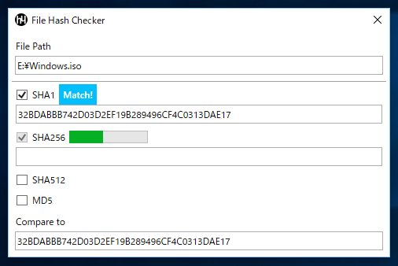

# File Hash Checker

A simple tool to check a file hash easily from explorer's context menu.

 
(DPI: 125%)

## Requirements

 * .NET Framework 4.7.2

## Download

:floppy_disk: [Download](https://github.com/emoacht/FileHashChecker/releases/latest)

## Usage

 - Drag and drop a file to be checked to the window. Or select a file from file dialog.
 - Paste a string of expected value in `Expected Value`. Or read it directly from clipboard.
 - To send a file from "Send to" of explorer's context menu, tap hamburger button in title bar and check `Enable to send file from explorer's context menu`.

## License

 - MIT License
