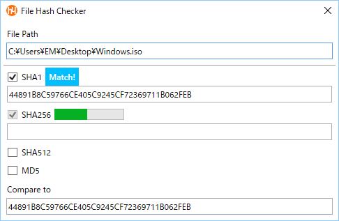

# File Hash Checker

A simple tool to check a file hash by drag and drop

## Requirements

 * .NET Framework 4.5.2

## Download

:floppy_disk: <a href="https://github.com/emoacht/FileHashChecker/releases/download/1.4.0/FileHashChecker140.zip">Download</a>

## Usage

 - Drag and drop a file to be checked to the window.
 - Paste a string of expected hash in "Compare to" box to check if the hash matches it.

## License

 - MIT License
